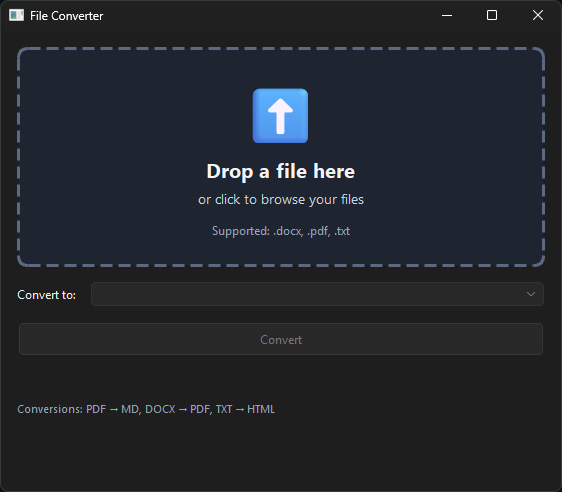
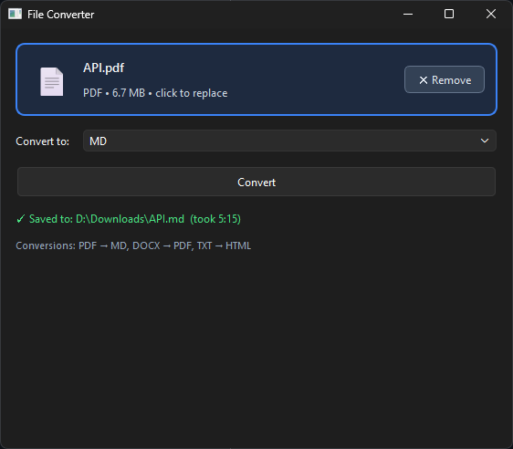

# File Converter

A simple Windows desktop app for converting between common document formats.
Pick a file, pick an output format, click Convert. No command line, no
account, no upload to anyone's server — everything runs locally on your
machine.


## What it does

| From | To       | Notes                                  |
| ---- | -------- | -------------------------------------- |
| PDF  | Markdown | Extracts text, headings, lists         |
| DOCX | PDF      | Requires Microsoft Word installed      |
| TXT  | HTML     | Wraps content in a clean styled page   |

The format dropdown updates automatically based on what file you load —
load a PDF and you'll only see "MD" as an option, load a DOCX and you'll
see "PDF", and so on.

## Why use it

- **Private.** Files never leave your computer.
- **Free.** No subscription, no signup, no ads.
- **Simple.** Two clicks and a save dialog. That's it.
- **Lightweight.** Single Windows app, no browser tab, no installer.

## Screenshots






## Install

### Option 1 — Download the .exe (easiest)

1. Go to the [latest release](https://github.com/Nathen13/File-Converter/releases/latest)
2. Download `FileConverter-v0.1.0-windows.zip`
3. Extract it anywhere on your computer
4. Double-click `FileConverter.exe` to launch

Windows may show a SmartScreen warning the first time — click "More
info" → "Run anyway." This is normal for unsigned apps.

### Option 2 — Build it yourself

You'll need [Python 3.11+](https://www.python.org/downloads/windows/)
installed on Windows. During Python install, **check the box that says
"Add python.exe to PATH"**.

Then:

1. Click the green **`<> Code`** button on this page → **Download ZIP**
2. Extract the zip somewhere convenient (e.g. `C:\Projects\`)
3. Open the `file_converter` folder
4. Double-click **`setup.bat`** — installs dependencies (one time only)
5. Double-click **`build.bat`** — produces `dist\FileConverter\FileConverter.exe`
6. Right-click the .exe → Send to → Desktop (create shortcut), or pin it to Start

That's it. Launch the shortcut anytime to use the app.

## Using the app

1. Click **Select File…** and pick a PDF, DOCX, or TXT file
2. Pick an output format from the dropdown
3. Click **Convert**, then choose where to save the output

## Limitations & known issues

- **DOCX → PDF needs Microsoft Word installed.** The app drives Word in
  the background to do the conversion (this is how most pro tools do it
  too — Word's own renderer is the most accurate). If Word isn't
  installed, that one conversion will fail with a clear message; the
  other conversions still work fine.
- **Windows only.** The build process and `docx2pdf` library are
  Windows-specific. macOS / Linux support isn't planned.
- **Windows SmartScreen warning.** The .exe is unsigned, so Windows may
  show an "unrecognized app" warning the first time you run it. Click
  "More info" → "Run anyway." Code signing requires a paid certificate
  and isn't worth it for a personal project.

---

## For developers

### Tech stack

- **Python 3.11+** — language
- **PyQt6** — GUI framework
- **PyMuPDF / pymupdf4llm** — PDF parsing and Markdown extraction
- **docx2pdf** — DOCX rendering via Word COM automation
- **PyInstaller** — packages everything into a standalone `.exe`

### Project structure

```
file_converter/
├── main.py                  # entry point
├── requirements.txt
├── build.spec               # PyInstaller config
├── setup.bat                # one-time dev setup
├── run.bat                  # launch from source
├── build.bat                # build the .exe
├── gui/
│   └── main_window.py       # PyQt6 window + worker thread
└── converters/
    ├── base.py              # BaseConverter ABC + ConversionError
    ├── registry.py          # add new converters here
    ├── pdf_to_md.py
    ├── docx_to_pdf.py
    └── txt_to_html.py
```

### Architecture

Three layers with a deliberately narrow contract:

1. **GUI** (`gui/main_window.py`) — PyQt6 window. File picker, format
   selector, status. Submits work to a `QThread` worker so the UI stays
   responsive on large files.
2. **Worker** — runs `convert()` off the UI thread, emits `finished_ok`
   or `finished_err` signals.
3. **Converters** (`converters/`) — strategy pattern. One subclass of
   `BaseConverter` per format pair. The registry maps
   `(input_ext, output_ext) → converter instance`. The GUI is
   registry-driven, so it can never get out of sync with what's actually
   implemented.

### Development setup

```powershell
git clone https://github.com/Nathen13/File-Converter.git
cd File-Converter
.\setup.bat              # creates .venv, installs deps
.\run.bat                # launches the app from source
```

### Adding a new conversion

1. Create `converters/<from>_to_<to>.py` with a class subclassing
   `BaseConverter`. Set `input_ext` / `output_ext` (lowercase, no dot)
   and implement `convert(input_path, output_path)`.
2. Import the class in `converters/registry.py` and append an instance
   to the `CONVERTERS` list.

The GUI auto-populates the format dropdown from the registry — no UI
changes needed.

### Building the .exe

```powershell
.\build.bat
```

Output: `dist\FileConverter\FileConverter.exe` plus its supporting
DLLs. The whole `dist\FileConverter\` folder is the app — keep its
contents together.

For a single-file .exe (slower first launch, easier to share), edit
`build.spec` or use:

```powershell
pyinstaller --onefile --windowed --name FileConverter ^
  --hidden-import pymupdf4llm --hidden-import docx2pdf ^
  --hidden-import win32com.client --hidden-import pythoncom main.py
```

## License

[MIT](LICENSE) — do whatever you want with it.
